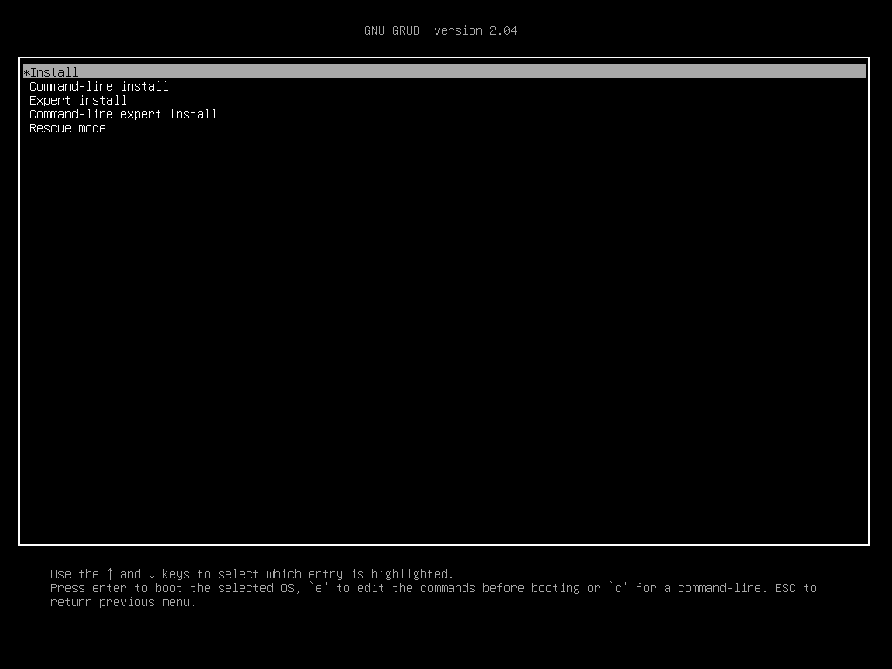
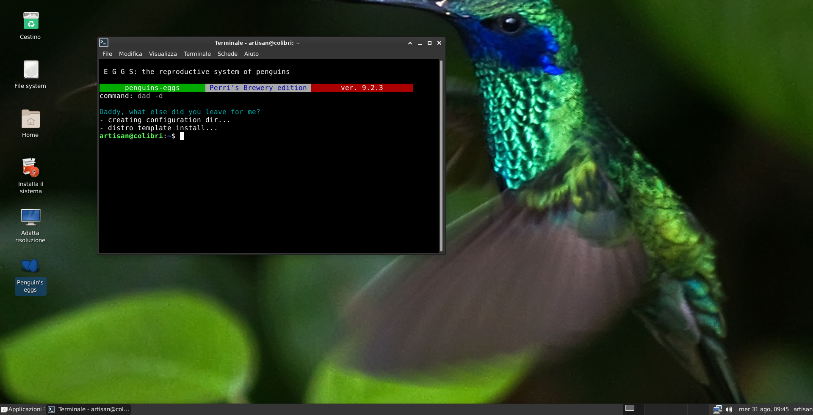

# Ubuntu x64 22.04 Xibo Client

## Requisitos
- Ubuntu Minimal >= 18.04
- Xibo Player >= 1.8-R6
- Penguins Eggs >= 9.6.13

## Ubuntu Minimal

<br>

Página de Download: [https://help.ubuntu.com/community/Installation/MinimalCD](https://help.ubuntu.com/community/Installation/MinimalCD)

Arquivo de imagem x64: [mini.iso](http://archive.ubuntu.com/ubuntu/dists/bionic-updates/main/installer-amd64/current/images/netboot/mini.iso)

- Dados de instalação do Sistema
    - Usuário: admclient
    - Nome completo de usuário: Administrador
    - Senha: 123456 (temporária)
    - Hostname: xibo-client
    - Pacotes opcionais: OpenSSH Server e Xubuntu Mininal

## Configuração

### Atualizar sistema

- Verificar versão do Ubuntu
```bash
lsb_release -a
```

- Atualização completa do sistema para versão 20.04
```bash
sudo apt update
sudo apt upgrade -y
sudo apt dist-upgrade -y
sudo apt autoremove -y
sudo apt install update-manager-core -y
sudo do-release-upgrade
```

- Verificar versão do Ubuntu
```bash
lsb_release -a
```

- Atualização completa do sistema para versão 22.04
```bash
sudo apt update
sudo apt upgrade -y
sudo apt dist-upgrade -y
sudo apt autoremove -y
sudo do-release-upgrade
```

- Verificar versão do Ubuntu novamente
```bash
lsb_release -a
```

### Instalação de Softwares básicos

- Atualizar repositórios
```bash
sudo apt update
```

- Pacotes básicos
```bash
sudo apt install gnome-system-tools -y
sudo apt install xfce4-taskmanager -y
sudo apt install gparted -y
sudo apt install ristretto -y
sudo apt install atril -y
sudo apt install mate-calc -y
sudo apt-get install simple-scan -y
sudo apt install thunar-archive-plugin -y
sudo apt install engrampa -y
```

- Navegador e Editor de Texto
```bash
sudo snap install firefox
sudo snap install sublime-text --classic
```

- Multimedia Codecs
```bash
sudo apt install ffmpeg -y
sudo apt install vlc -y
sudo apt install ubuntu-restricted-extras -y
```

## Usuário player
- Criação de usuário no sistema sem privilégios e sem senha 
```bash
sudo adduser --disabled-password player --gecos 'Player'
sudo passwd -d player
```

- Configuração para login automático do usuário player
```bash
sudo bash -c "cat >  /etc/lightdm/lightdm.conf <<EOF
[Seat:*]
autologin-guest=false
autologin-user=player
autologin-user-timeout=0
EOF"
```

## Xibo Digital Signage Player
<br>

Página de Download: [https://snapcraft.io/xibo-player](https://snapcraft.io/xibo-player)

Versão estável: 1.8-R6

- Instalação
```bash
sudo snap install xibo-player
```

- Configuração para iniciar automaticamente o player
```bash
mkdir -p /home/player/.config/autostart
cat >  /home/player/.config/autostart/Xibo-Player.desktop <<EOF
[Desktop Entry]
Encoding=UTF-8
Type=Application
Name=Xibo Player
Comment=Xibo Player
Exec=xibo-player
OnlyShowIn=XFCE;
RunHook=0
StartupNotify=false
Terminal=false
Hidden=false
Icon=/snap/xibo-player/current/meta/gui/xibo-player.png
EOF

chmod a+x /home/player/.config/autostart/Xibo-Player.desktop
source /home/player/.config/user-dirs.dirs
cp /home/player/.config/autostart/Xibo-Player.desktop "$XDG_DESKTOP_DIR/Xibo-Player.desktop"
```

- Definir as configurações no Xibo Player
    - IP do servidor Xibo
    - Chave de acesso

## Scripts Xibo Client

- Definição de Hostname, login automático player e configuração do ssh do xibo-client
```bash
mkdir -p /home/admclient/scripts
echo '#!/bin/bash' > /home/admclient/scripts/hostname.sh
cat >> /home/admclient/scripts/hostname.sh <<EOF
read -p 'Informe o numero do Host Xibo Client (1, 2, 3, ...): ' NUM_HOST_XIBO_CLIENT
sudo hostnamectl set-hostname "\$HOSTNAME-\$NUM_HOST_XIBO_CLIENT"
OLD_HOSTNAME=$HOSTNAME
echo -e "Hostname Xibo Client: \$OLD_HOSTNAME-\$NUM_HOST_XIBO_CLIENT"
EOF

echo -e "sudo bash -c 'cat >  /etc/lightdm/lightdm.conf <<EOF
[Seat:*]
autologin-guest=false
autologin-user=player
autologin-user-timeout=0
EOF'" > /home/admclient/scripts/autologin.sh

cat >> /home/admclient/scripts/ssh.sh <<EOF
sudo apt update
sudo apt autoremove -y
sudo apt upgrade -y
sudo apt remove openssh-server -y
sudo apt autoremove -y
sudo apt install openssh-server -y
sudo systemctl enable --now ssh
EOF

chmod +x /home/admclient/scripts/hostname.sh
chmod +x /home/admclient/scripts/autologin.sh
chmod +x /home/admclient/scripts/ssh.sh

./home/admclient/scripts/hostname.sh
./home/admclient/scripts/autologin.sh
./home/admclient/scripts/ssh.sh
```

## Penguins' Eggs

Site Oficial: [https://penguins-eggs.net/](https://penguins-eggs.net/)

Documentação: [https://penguins-eggs.net/docs/Tutorial/eggs-users-guide](https://penguins-eggs.net/docs/Tutorial/eggs-users-guide)

Versão atual: 9.6.13

Download: [https://sourceforge.net/projects/penguins-eggs/files/DEBS/](https://sourceforge.net/projects/penguins-eggs/files/DEBS/)

<br>

- Instalação
```bash
sudo wget "https://gigenet.dl.sourceforge.net/project/penguins-eggs/DEBS/eggs_9.6.13_amd64.deb" \
-O /tmp/eggs.deb

sudo chmod a+x /tmp/eggs.deb

sudo apt install /tmp/eggs.deb -y

sudo rm /tmp/eggs.deb
```

- Configuração
```bash
sudo eggs dad --default
sudo eggs calamares --install
```

<!-- - Configuração de idioma, usuário e rede no modo de instalação não assistida (unattended)
```bash
sudo bash -c "cat > /etc/penguins-eggs.d/krill.yaml <<EOF
# Penguins' eggs
# krill.yaml
---
# welcome
language: 'pt_BR.UTF-8'

# location
region: 'America'
zone: 'Campo_Grande'

# keyboard
keyboardModel: 'pc105'
keyboardLayout: 'br'
keyboardVariant: ''
keyboardOption: ''

# partition (leave it unchanged)
installationDevice: ''
installationMode: 'standard'
filesystemType: 'ext4'
userSwapChoice: 'small'

# users
name: 'admclient'
fullname: 'Administrador'
password: '123456'
rootPassword: 'root'
autologin: true
hostname: 'xibo-client'

# network
iface: ''
addressType: 'dhcp'
address: ''
netmask: ''
gateway: ''
domain: ''
dns: ''
EOF"
``` -->

- Configuração geral do Penguins Eggs no modo de live iso
```bash
sudo cp /etc/penguins-eggs.d/eggs.yaml /etc/penguins-eggs.d/eggs.yaml.bkp

sudo bash -c 'sed -i -E "/locales:/,/^[^ ]/ {/^[^ ]/!d}" /etc/penguins-eggs.d/eggs.yaml'

sudo bash -c "sed -i -e 's/snapshot_prefix:.*/snapshot_prefix: ubuntu-22.04-x64-/' \
-e 's/snapshot_basename:.*/snapshot_basename: xibo-client/' \
-e 's/user_opt:.*/user_opt: ubuntu/' \
-e 's/user_opt_passwd:.*/user_opt_passwd: ubuntu/' \
-e 's/root_passwd:.*/root_passwd: root/' \
-e 's/compression:.*/compression: max/' \
-e 's/timezone:.*/timezone: America\/Campo_Grande/' \
-e 's/locales_default:.*/locales_default: pt_BR.UTF-8/' \
-e 's/locales:.*/locales:\n  - pt_BR.UTF-8\n  - en_US.UTF-8/' \
/etc/penguins-eggs.d/eggs.yaml"


sudo cp /etc/penguins-eggs.d/addons/eggs/theme/calamares/modules/locale.yml \
/etc/penguins-eggs.d/addons/eggs/theme/calamares/modules/locale.yml.bkp

sudo bash -c "sed -i -e 's/region:.*/region: \"Mato Grosso do Sul\"/' \
-e 's/zone:.*/zone: \"\"/' \
-e 's/style: \"json\".*/style: \"fixed\"/' \
-e 's/selector: \"timezone\".*/selector: \"America\/Campo_Grande\"/' \
/etc/penguins-eggs.d/addons/eggs/theme/calamares/modules/locale.yml"
```

### Criar imagem do sistema
- Apagar as configuracoes do Xibo Player
```bash
sudo rm -R /home/player/snap/xibo-player
```

- Criar cópia completa do sistema e gerar Imagem ISO
```bash
sudo eggs tools clean
sudo eggs produce --clone --max
```

- Será gerado um arquivo de imagem ISO no diretório `/home/eggs/mnt`
```bash
sudo ls -l /home/eggs/mnt/*.iso
```
