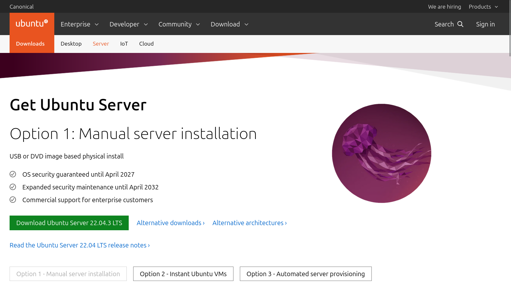
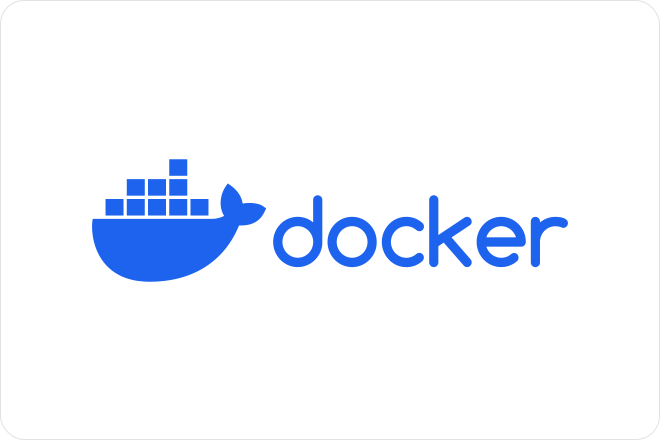
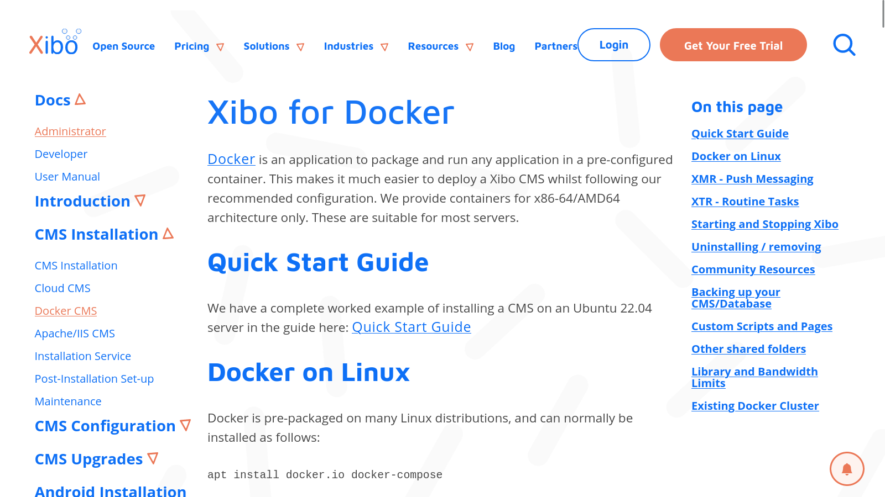
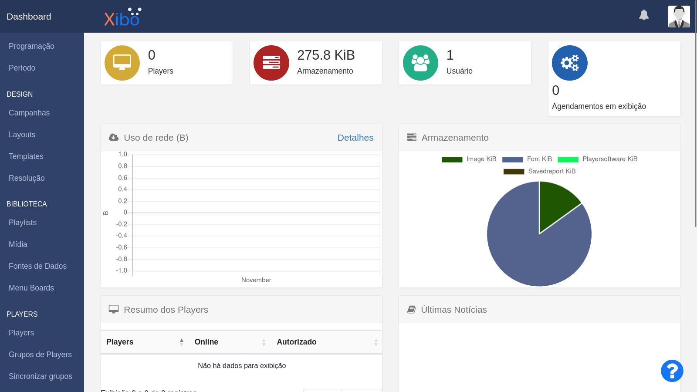

# Xibo Server

## Requisitos
- Ubuntu >= 22.04
- Docker >= 24.0.7
- Docker Compose >= v2.23.0


## Get Ubuntu Server 22.04.3 LTS
Página de Download: [https://ubuntu.com/download/server](https://ubuntu.com/download/server)

Arquivo de imagem x64: [ubuntu-22.04.3-live-server-amd64.iso](https://releases.ubuntu.com/22.04.3/ubuntu-22.04.3-live-server-amd64.iso)

<br>

- Dados de instalação do Sistema
    - Usuário: admserver
    - Nome completo de usuário: Administrador
    - Senha: 123456 (temporária)
    - Hostname: xibo-server

## Docker

<br>

Install Docker Engine on Ubuntu: [https://docs.docker.com/engine/install/ubuntu/](https://docs.docker.com/engine/install/ubuntu/)

- Instalação Docker
```bash
sudo apt install apt-transport-https ca-certificates curl software-properties-common
curl -fsSL https://download.docker.com/linux/ubuntu/gpg | sudo apt-key add -

sudo add-apt-repository "deb [arch=amd64] https://download.docker.com/linux/ubuntu focal stable"

sudo apt update

sudo apt install docker-ce
```

- Instalação Docker Compose
```bash
sudo wget "https://github.com/docker/compose/releases/download/v2.23.0/docker-compose-$(uname -s)-$(uname -m)" \
-O /usr/local/bin/docker-compose

sudo chmod +x /usr/local/bin/docker-compose
```

- Verificar versão instalada
```bash
docker-compose --version
```

## Xibo for Docker

<br>

Xibo for Docker: [https://xibosignage.com/docs/setup/xibo-for-docker](https://xibosignage.com/docs/setup/xibo-for-docker)

Versão: 3.3.7

### Instalação do Xibo usando Docker Compose

- Download
```bash
sudo mkdir -p /opt/xibo && cd /opt/xibo

sudo wget "https://github.com/xibosignage/xibo-cms/releases/download/3.3.7/xibo-docker.tar.gz" \
-O xibo-docker.tar.gz

sudo tar xvzf xibo-docker.tar.gz -C .

XIBO_FOLDER=$(ls -l /opt/xibo | grep '^d' | grep -iwo "xibo-docker-[0-9].[0-9].[0-9]")
sudo mv $XIBO_FOLDER xibo-docker && cd xibo-docker
```

- Configuração das variáveis de ambiente:
     - MYSQL_PASSWORD: senha do banco de dados MySQL
     - CMS_SERVER_NAME: endereço do server

```bash
sudo touch /opt/xibo/xibo-docker/config.env
sudo bash -c 'cat > /opt/xibo/xibo-docker/config.env <<EOF
MYSQL_PASSWORD="@dminroot"
CMS_SERVER_NAME=xibo.local
EOF'

sudo bash -c 'echo "127.0.0.1           xibo.local" >> /etc/hosts'
```

- Criação dos Containers do Xibo Server
```bash
cd /opt/xibo/xibo-docker
sudo docker-compose -f docker-compose.yml up -d
```

- Acesso ao Xibo pelo navegador
    - Endereço: [http://xibo.local/login](http://xibo.local/login)
    - Usuário: xibo_admin
    - Senha: password

<br>

- Chave do Servidor
    - Anotar a chave para conexão dos Players
    - [http://xibo.local/admin/view](http://xibo.local/admin/view)